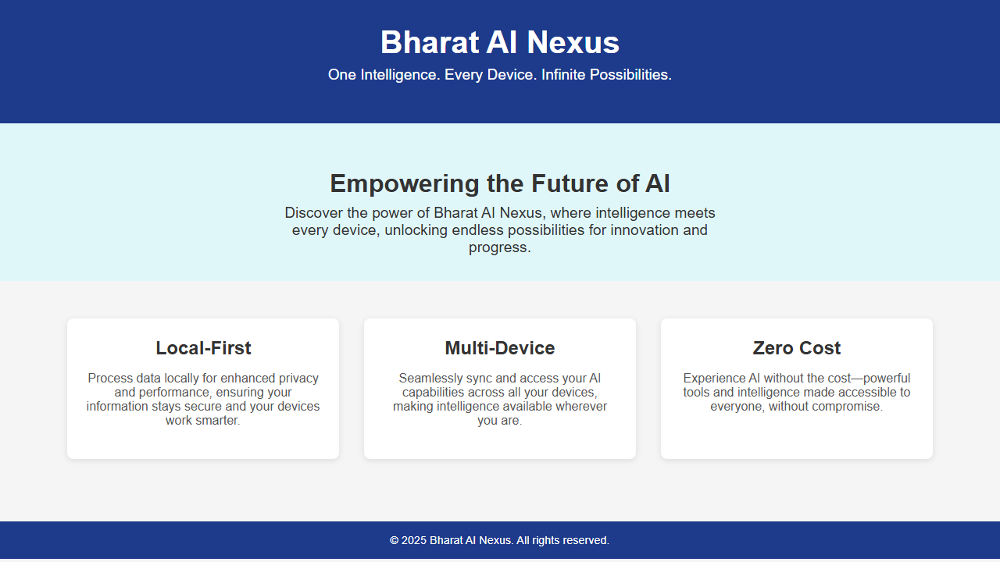

# Task 3 Report: Intelligent Feature — Bharat AI Nexus

**Author:** Kushagra Gupta · **Internship:** SWYNEX Technologies

## The feature

Bharat AI Nexus is a local-first personal AI assistant: one backend that routes each request to the smallest capable model, remembers past conversations, asks permission before risky actions, speaks and listens offline, and can write and verify code and web pages on its own. It runs on a laptop (i5, 16GB RAM, RTX 2050 with 4GB VRAM) with no mandatory paid AI API.

## What was built

| Capability | How it works | Evidence |
|---|---|---|
| Model router | Local Ollama models first; Groq cloud for heavier "reasoning" tasks or when local fails; falls back the other way too | A `reasoning` request returned from Groq in ~1s vs ~45s on the local fallback. A request with no key set fell back to local automatically |
| Persistent memory | Every message embedded (nomic-embed-text) and stored in Postgres + pgvector; relevant history retrieved by cosine similarity | Told it "my cat is Nimbus, I like Rust"; a later question recalled both (2 memory hits). History survived a full backend restart |
| Permission tiers | 5 levels. Reads and generated files run automatically; system changes wait for explicit approval; every call logged | A destructive action stayed pending and changed nothing until approved; rejecting it left data intact |
| Offline voice | whisper.cpp for speech-to-text, Piper for text-to-speech, ffmpeg to convert browser audio | Synthesised a sentence and transcribed it back verbatim, including from WebM/Opus (what browsers send) |
| Sandboxed coding agent | Generates Python, runs it in a throwaway Docker container (no network, 256MB, 1 CPU), feeds errors back, retries up to 2 times | Fibonacci task passed first try. An unsolvable task showed 3 logged attempts and an honest failure. A network request failed at DNS, proving isolation |
| Web-builder agent | Generates a single-file HTML page, loads it in headless Chromium with network blocked, lints the markup, retries on errors | Landing page generated and verified with zero errors (screenshot below) |

## Results

The page above was generated from one sentence, verified in a real browser, and passed an HTML lint check on the first attempt. Source: `demo-page.html`.

## Key learnings

1. **Verify with evidence, not claims.** My first verifier only checked for JavaScript errors. It approved a generated page that contained a stray `<` character, because browsers silently repair bad markup. I added a structural HTML lint pass (`app/htmllint.py`) that flags that exact defect (confirmed at line 97 of the old page) and shares the retry loop with the browser checks.
2. **Small settings can dominate performance.** Disabling the model's "thinking" mode cut local responses from 30+s to 2-8s with no loss on short tasks. A cloud call was ~1s.
3. **Windows asyncio has sharp edges.** The database driver needs one event-loop type and subprocess launching needs another. The fix was to run subprocess work (voice, Docker, Playwright) via `subprocess.run` rather than fight the loop.
4. **Dependencies drift.** The cloud model I hardcoded was retired by the provider (HTTP 404) and two local models had been removed from the machine. Defaults are now configurable and the README lists the expected models.

## Honest limitations

- A 4GB GPU is the bottleneck: generating a full page with the local 8B model took ~3.5 minutes. Cloud routing is much faster.
- The microphone button was not tested in a live browser (the test browser blocks mic access); the speech pipeline behind it was tested directly.
- Web search is built and permission-gated, but I did not test it against the live search API (no key configured).
- The verifier's retry-on-lint-failure path was tested on the linter in isolation, but a live run has not yet hit it, since the latest page was valid on the first try.

## Repository

https://github.com/kushagra486/SWYNEX-Intelligent-Feature — see `README.md` for setup and per-phase details.
